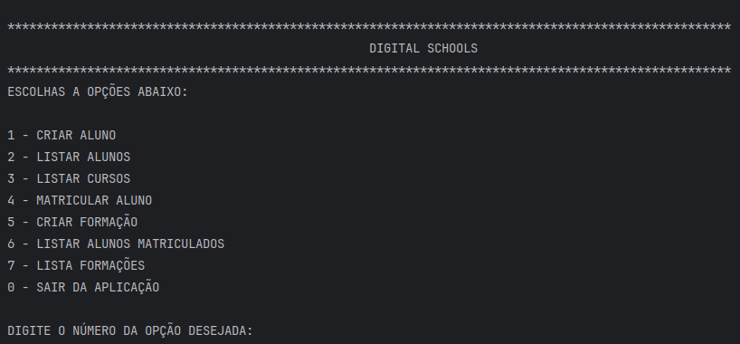

# Projeto Formações Digital School
### Este é um repositório para que faz parte da trilha de formação do [Bootcamp Code Update TQI - Backend com Kotlin e Java](https://www.dio.me/bootcamp/code-update-tqi-backend-com-kotlin-e-java) na [DIO](https://www.dio.me/), escrito em Kotlin.

### :dart: objetivo 
O objetivo deste repositório é aplicar conceitos de orientação a objetos e explorar os principais recursos da linguagem
Kotlin, como classes, herança, polimorfismo e extensões O repositório contém exemplos práticos e exercícios para ilustrar 
o uso desses recursos em diferentes cenários.

### :computer: Características
A aplicação desenvolvida tem como finalidade o gerenciamento de uma escola de tecnologia, precisa-se cadastrar os alunos,
os conteúdos educacionais que irão compor as formações. E cada formação tem opção de matricular os alunos cadastrados no
sistema

### :airplane: Como usar
Para usar este projeto, siga os passos abaixo:

1. Clone o repositório para a sua máquina local.
2. Abra o projeto no seu IDE preferido que suporte Kotlin.
3. Execute o projeto, a partir do arquivo `src/main/kotlin/app/Main.kt`.

